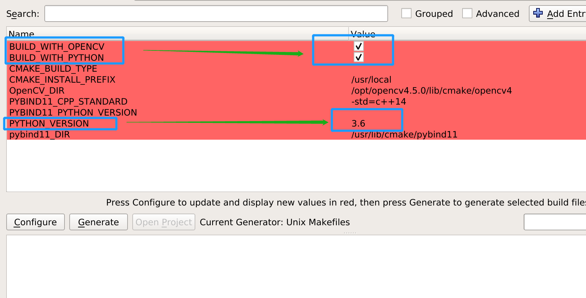

# English version
## 1. TODO


# 中文说明
## 1. EXR格式介绍
EXR格式可以用于图片的存储，主要是他可以用浮点数保存图片的每一个像素。这对于我们而言可以很方便的保存一个图片的很多数据，
包括RGB以及depth。特别是depth，这用其他格式保存，还要经过数据格式转换，这十分复杂。类似的，对于normal这样的数据，他包涵有负数，
用传统的二进制或者图片保存，不仅读取不方便，还会丢失精度。
## 2.安装与说明
本代码目前只支持linux。也许支持windows，但是可以fork来二次开发。
考虑到本代码目前主要用于法向量估计，所以读取的数据全部以float格式为准。半float格式暂时不支持。
首先本代码支持opencv,和python调用。传统的opencv格式对openexr格式支持不完整.
你可以用cmake-gui或者直接修改CMakeLists.txt的代码，选择是否安装opencv或者python版本。
## 2.1  python依赖项
```
sudo apt-get install openexr
```
下面是对python的支持，以python3.6为例，其他python版本只要修改3.6为3.7或者其他数字即可。
当然，你可以通过其他方式进行安装python。但是我没有测过。
```
sudo apt-get install pybind11-dev 
sudo apt-get install python3.6-dev
sudo apt-get install libpython3.6
sudo apt-get install libpython3.6-dev
sudo apt-get install libpython3.6-stdlib
```

## 2.2 opencv依赖项
```
sudo apt-get install libopencv-dev
```
当然，你也可以使用其他方式进行安装,但是我没有测过。


# 3.编译安装

如果你可以使用cmake-gui，则可以修改的参数有以下几个


看cmake代码的这部分，前两行你可以把false改为true，来开启对OPENCV或者PYTHON的支持。本代码默认是开启对python和opencv的支持。如果你不想要其中某个功能，可以取消掉。
第三行是默认3.6版本的python，你可以根据你的需求修改为你需要的python版本。
```
set(BUILD_WITH_OPENCV false CACHE BOOL "build opencv lib, then you can load exr to pencv")
set(BUILD_WITH_PYTHON false CACHE BOOL "build python lib, then you can use python to import exrio")
set(PYTHON_VERSION 3.6 CACHE STRING "set your python version, you can set 3.6 3.7 3.8 2.7 or others")
```

然后就很简单了，执行以下代码即可
```
mkdir build
cd build
cmake ..
make -j1
sudo make install
```
如果你懂cmake-gui的话，那么我不用说你们也知道怎么用。

# 4 样例
# 4.1 读取opencv的mat
程序目录里有一个CmakeExample的文件夹，里面有readexr_opencv.cpp文件，和CMakeLists.txt可以作为使用的参考。
# 4.2 利用python读取
程序目录里有一个PythonExample文件夹，里面有demo.py,可以用来读取exr格式。
太忙了（懒），还没有实现返回channel name的功能，所以返回的图像会按照字典序排序。
等我不忙了（不懒了）再实现这个功能。或者如果有足够多的star.

# 5. 一些BUG
当你的python不能正常work的话，可以考虑以下方法：
sudo make install后，会在目录下生成一个文件夹python_module_output
里面会有一个exrio_python类似的文件。
如果你编译出来的exrio_python的后缀不是so，或者没有so为后缀，那么把他修改为exrio_python.so
随后把这个文件放在你对应python的site-packages/exrio/的文件夹即可
如：/usr/lib/python3.6/site-packages/exrio/exrio_python.so
随后再尝试


# 下面的不用看
then you can use it.
an CMAKE example can be see in 'CmakeExample'

and you can easily to use our code to load EXR format file, and convert it to opencv cv::Mat


写个中文的说明先。

回头再改。

# 基本依赖
```
sudo apt-get install openexr
sudo apt-get install pybind11-dev
```


# C++ 教程

```
 mkdir build
 cmake ..
 sudo make install
```
随后可以参考目录下CmakeExample的结构，构造一个cmake项目，可以方便的使用本代码。


# Python 教程

目前python只实现了读取openexr格式的读取操作,

首先确保电脑已经安装python. ubuntu 18.04默认是python2.7和python3.6
ubuntu 20.04 默认的python版本是python3.8
当然你可以用apt-get install libpython3.8 或者 apt-get install libpython3.7 之类的来安装你想要的版本
当然，别忘了使用sudo apt-get install python3.8-dev 或者 sudo apt-get install python3.7-dev 来安装相关的头文件

```
mkdir build
cmake ..
sudo make install
```

此时文件夹里，应该出现一个新的文件夹叫 python_module_output
里面有一个readexr_py或者readexr_py.so的文件。
不管生成了啥，重命名为readexr_py.so即可。
这是一个宝贝文件，他是可以被import的。
你把他放入比如/usr/local/lib/python3.6/dist-packages/里面，新建一个文件夹就叫readexr_py,然后把他放在文件夹里就可以了。
注意！！！这里python3.6或者python3.7，取决于你cmake的时候输出的的cmake版本。
如果想指定python的版本的话，在CMakeLists.txt中修改PythonLibs后面的版本号即可。

这时候，你可以运行PythonExample文件夹里的程序demo.py
这是一个示范如何读取exr格式的程序。【因为我还没有制作让python有多个返回值。所以先将就一下，我歇歇再写】


